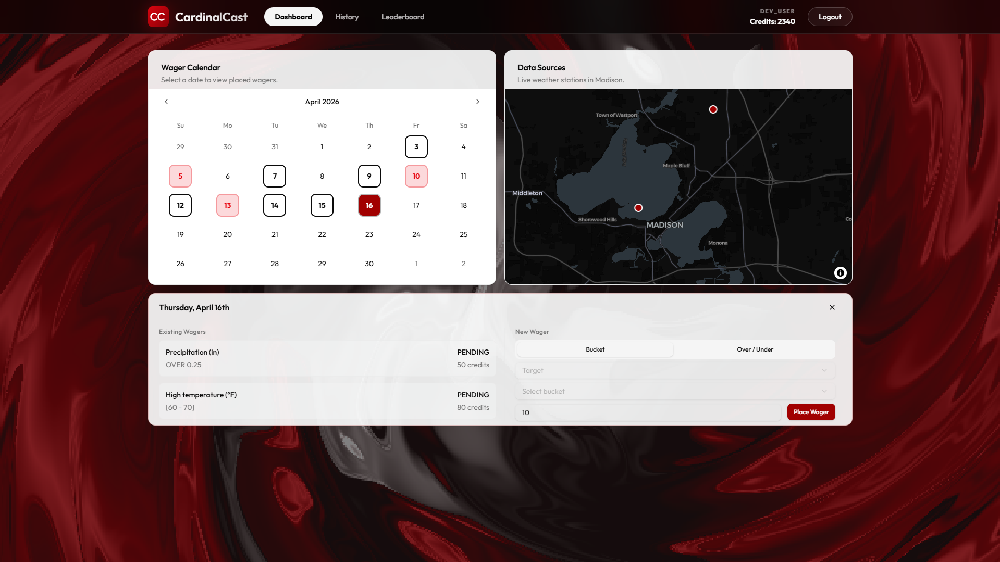
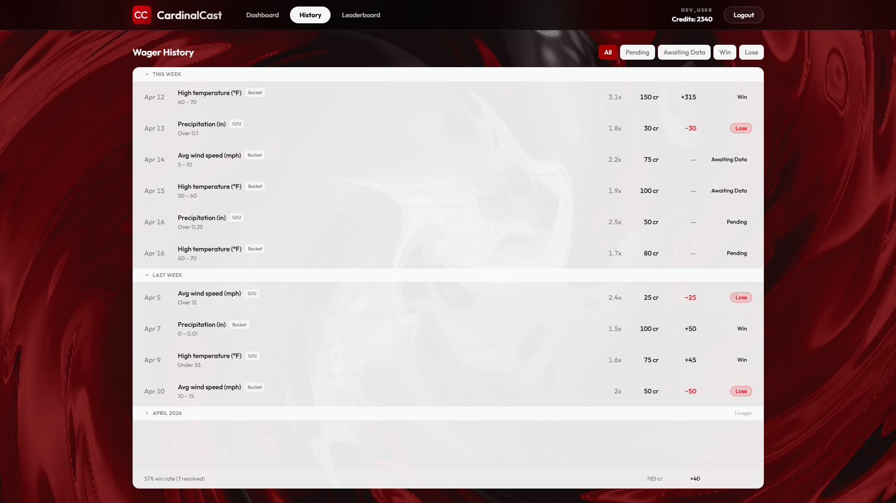

  

CardinalCast is a Madison prediction market that allows users to place wagers on weather outcomes and win credits based on NOAA weather data. This system leverages XGBoost quantile regression (P10/P50/P90) to generate dynamic odds distributions that account for prediction uncertainty and historical forecast errors, enabling risk-adjusted wagering on temperature, wind, and precipitation outcomes.

### Core Functionality
* **ML-Powered Pricing:** Generates dynamic probability distributions using historical forecast errors and risk-adjusted uncertainty.
* **Automated Data Pipeline:** Daily ingestion of NOAA actuals and forecasts for scheduled wager resolution.
* **Interactive Wagering Interface:** React/TypeScript dashboard with weather map visualization, bucket-based wagers, over/under betting, and live leaderboard tracking.

  
<b>View Screenshots</b>

   

| Dashboard | History |
| :---: | :---: |
|  |  |

## Impact & Performance

* **ML Model Accuracy:** 4.35°F MAE (high temp) with 81–85% interval coverage on held-out test set
* **System Latency:** Sub-100ms API response times for odds generation and wager placement
## Documentation

* **[SETUP.md](docs/SETUP.md):** Installation, environment configuration, and startup instructions.
* **[ARCHITECTURE.md](docs/ARCHITECTURE.md):** System design, data flow, glossary, and design decisions.
* **[API.md](docs/API.md):** REST API endpoint reference and authentication.
* **[TESTING.md](docs/TESTING.md):** Testing guidelines and strategy.
* **[STYLE.md](docs/STYLE.md):** Coding standards, testing guidelines, and repository conventions.

## License

See **[LICENSE](LICENSE)** file for details.
